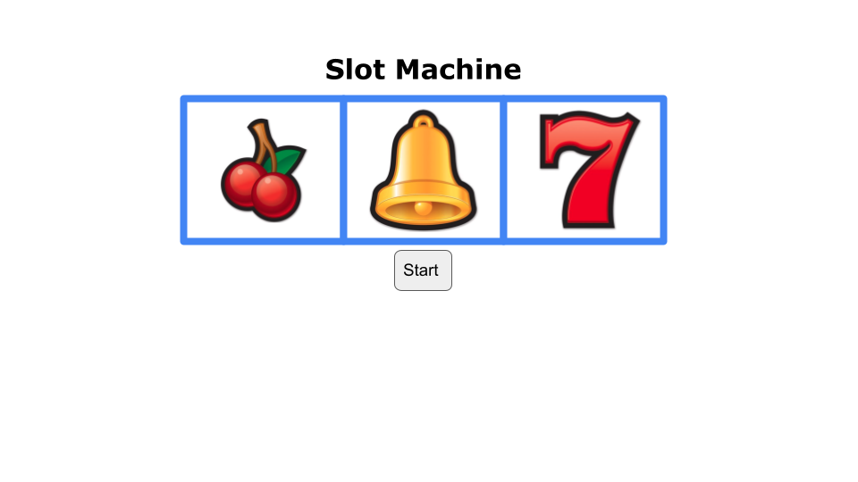

# Slot Machine
The slot machine's standard layout features a screen displaying three reels that "spin" when the game is activated. 
The sping is activated by pressing the "push button" or the lever. Slot machines operate randomly. 

Slots usually have three reels but sometimes also have five reels. The reel is the image that spins in the front of the machine. 
It has multiple symbols on it, and if you line up certain combinations of symbols, you win.

## The Symbols
The very first, primitive slots used card symbols – hearts, clubs, diamonds, and spades. 
Then Charles Fey, a native of San Francisco, who invented the machine, introduced horseshoes and the Liberty Bell. 
Horseshoes were a sign of good luck, while the bell represents American freedom. 
Soon the number seven became popular as a new symbol. It’s considered a lucky number by many gamblers, and it nudged out the poor old horseshoe.
In the 1900s  the  slot machine was banned. 
To get around the ban, the Bell-Fruit Gum Company created slots that satisfied thrill-seekers wishing to spin the reels, and paid out in gum, rather than cash.
Now you can see where the famous fruit symbols that are still so popular today started. 
Cherries, lemons, melons, pears, and oranges are still very common in casino slots. 
And he bar emerged from the idea that it looked like a bar of gum! (taken from : The TwinSpires Edge:The ultimate guide to slot machine symbols and icons)

## user stories
- MVP
As a user I would like to see
* three squares lined up together with a symbol on each one
* a "lever" button that makes the reels rotate at randon
* three symbols selected at random when I press the "lever" button
* an anounce that I have won if the the three symbols are the same
 
 -Slot Machine V2
* As a user I would like to have a "start" and a "stop" buton
* As a USer I would like to press the start button and be able to see the symbols rotating (display the simbols moving on the rectangles to represent the reels rotating)
* As a user I would like to be able to press the "stop" buton to stop the rotation
* As a user I would like to see three symbols chosen at random when I press the stop button.

## screenshots

* The system will generate a combination at random.
* If you get three equal symbols displayed on the three squares, you win!!
* If you don't get the combination of the three equal symbols, you loss. But you have the oportunity to play again.

## Built with

* HTML
* CSS
* JavaScript

## Next Steps

* Create a point system in which the player can earn points depending on what pictures the reels show on the squares.
* Allow the player acumulate points for each time he/she plays 
* Create a start button and an stop button
